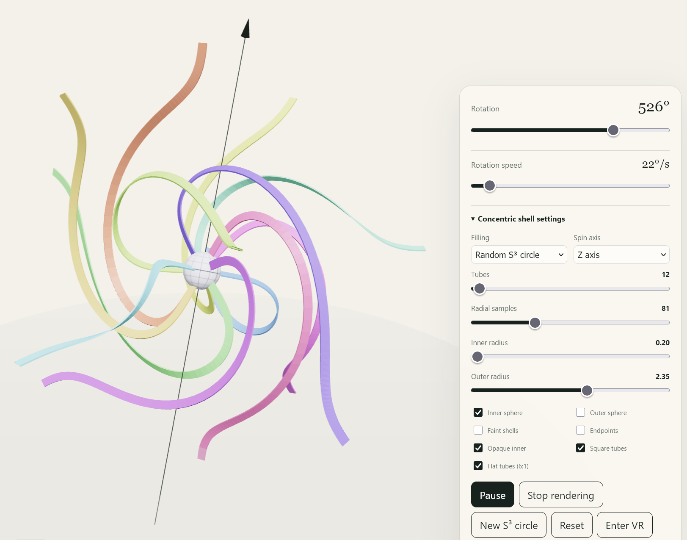
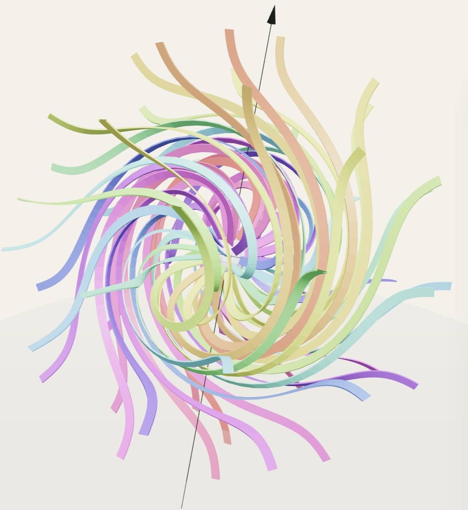
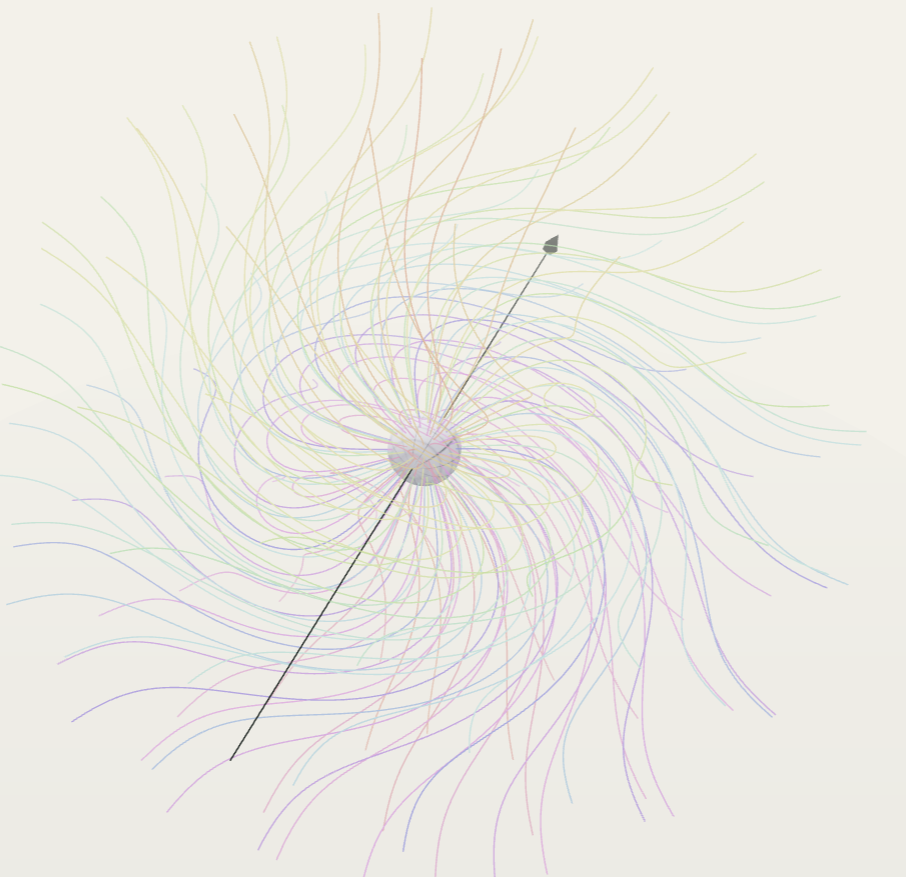

# Explore spinor representations

A no-build Three.js visualization of spinors, just C2 spinors that transform with SU(2).









Not AI text:
Basically we have a sphere, and in the middle we have "smth" rotating compared with the fixed sphere surface/rest of the world.
This should show how "smth" which is connected by wires to the rest of the world, can rotate indefinitely without tangling the wires.
This is also a visualization of a spinor rotating, which means that after one rotation (2 pi) it swiches direction, and only after 2 rotations it returns to the initial value.

It was quite difficult to arrive at an agreement with GPT about what I want and how it should work, but in the end we found together a simple idea / implementation.

So in the middle of the sphere we put a rotating SU(2) matrix, which is implemented as a rotating unit quartenion.
Basically this is a point on S3 (the sphere in 4 dimensions), and when we rotate it, it just means the point moves along a big circle around the S3 sphere.
Then we interpolate from this central value put in the middle of the S2 sphere (the normal sphere in 3 dimensions that we know and love) to the surface of the S2 sphere, where we have 0 rotation or transformation, i.e. the identity quartenion 1.

Implementation wise, we have a 3d quartenion field that evolves in time, which interpolates from the rotating quartenion value in the centre (or a small sphere in the centre, for better visibility) to the identity quartenion on a outer sphere. Each unit quartenion value on the field is equivalent to a SU(2) matrix, or a value on S3 sphere, or with a SO(3) matrix after projection. Also for each SU(2) we have an equivalent spinor (just take the first column). So in a way this is a rotating spinor field. We use quartenions for the state/values, and after quartenion conjugation we get normal 3D rotations.

The interesting part is that this simple interpolation, with full radial symmetry, encodes the way the lines/wires move naturally to not get tangled, sometimes they pass on one side of the center, sometimes they pass on the other side of the center.

Now the difficult part is how to compute and draw the shape of the wires. The wires should have one end fixed on the outer sphere, and the other end fixed on the rotating center sphere. The local SU(2) rotation in each point should influence the wire shape. Initially I thought that geodesics should be enough to describe the wires, but GPT math dissagreed. 
GPT suggested some integral curves, but it seemed to me it is difficult to finetune them. 
In the end the solution is to have many concentric sphere/shells, each is rotated a small ammount according to the local interpolation value. Then connect directly the corresponding points from all the spheres and we get a trajectory/wire that looks like what we want.
Minor: there are some small problems with a singularity when trying to find an interpolation from 1 to -1 quartenions (too many options, and a 0 quartenion which is not fun) but this happens only when we try to rotate the identity quartenion/rotation.
Then there is more work for visual improvements to the interpolation curve (still work in progress), shape of wires, etc.

Also interesting to see the animation in VR, where we can get a better feel for the 3D shape we are watching. We can look at it small in the hand, or make it as big as a house rotating around us.
Check this doc for the VR controller shortcuts.

## What It Shows

Switch between multiple views.

View 1: concentric spherical shells carry fixed angular labels between a
rotating inner sphere and a stationary outer sphere. Material wires use the
explicit nonsingular quaternion filling, with controls for the naïve
interpolation and a random great-circle trajectory on S³.

View 2: represent spinors as flags.
Take the Bloch sphere, and add spinors for all axis. Then rotate the sphere on a plane, show how the spinors / flags transform.
Use different colors for each spinor/flag.

View 3: take the same Bloch sphere and spinors, and slowly rotate with random SU2 matrix. Button to generate a new SU2 matrix.

View 4: trace three colored families of RK4 integral curves through a compact
SU(2) quaternion field. The central frame completes a 4π spin while the field
stays fixed outside its active radius; an off-axis escape term keeps the
intermediate field nonsingular.
This is the initial suggestion from GPT, probably can be made to work too.

## Runtime Controls

- `Pause simulation`: freezes simulation time, keeps rendering active.
- `Stop rendering`: stops the animation loop.
- `Enter VR`: starts an immersive WebXR session on compatible headsets such as Quest 3.
- `Space`: shortcut for pause/resume simulation.
- Mouse (OrbitControls): inspect scene manually.

## HUD

- Six view tabs switch between the concentric-shell, flag, SU(2),
  quaternion-field, particle-flow, and grid-flow scenes.
- The particle-flow view keeps the rotating textured core and emits temporary
  ribbon traces along the same material integral lines. It defaults to a random
  S³ circle, short 0.48-unit ribbons, and a fast 0.75-second lifetime; direction,
  length, and lifetime are adjustable.
- The grid-flow view releases a changing random subset of a configurable cubic
  lattice as short-lived field traces. Its traces use the same flat 6:1 tube
  cross-section as the concentric material tubes.
- The angle slider scrubs the full 0–720° spinor cycle.
- The speed slider controls automatic rotation from 0–900 degrees per second in every view.
- The flag-count slider switches between 6, 12, 24, and 48 flags in the flag-based views.
- The shell settings control 6–500 wires, radial-sample counts, both radii, X/Y/Z
  spin axes, boundary and endpoint visibility, inner-sphere opacity,
  quaternion-filling mode, and a square-cross-section tube alternative using
  the same configurable count as the wire bundle. Tubes can optionally use a
  flattened rectangular section whose broad side is six times its thin side.
- Pause, rendering, reset, random-generator, and WebXR controls are available
  contextually.

## Current Default Configuration (`src/config.js`)

- Initial scene: concentric shells with the outer sphere hidden.
- Inner sphere: opaque, radius `0.20`, with 12 flat 6:1 material tubes.
- Perspective camera: 38° field of view, position `(5.8, 3.8, 7.8)`.
- Bloch sphere radius: `1.62` scene units.
- Flag sample count: `12`.
- Automatic rotation speed: `22` degrees per second.

## Rendering Notes

- The app uses ES modules and local vendored Three.js files through an import map.
- The page uses a white background with light HUD chrome for better contrast
  against saturated section colors.


## Project Structure

- `index.html`: canvas, HUD, import map, and app entry point.
- `https_server.py`: local HTTPS static server for Quest 3 / WebXR testing.
- `styles/main.css`: responsive fullscreen layout and controls.
- `src/config.js`: camera and visualization defaults.
- `src/spinor-math.js`: rendering-independent spinor and geometry calculations.
- `src/main.js`: renderer, lifecycle, UI, and WebXR session handling.
- `src/visualizations.js`: flag, SU(2), quaternion-field, and
  concentric-shell scene implementations.

The sphere views keep their states as explicit normalized C² spinor arrays.
`src/spinor-math.js` constructs 2×2 complex SU(2) matrices and applies them
with `multiplySU2Spinor`; Three.js only renders the resulting Bloch directions
and full orientation frames. Each frame is converted directly from its spinor
to a quaternion, avoiding the antipodal-vector singularity of reconstructing
an orientation from the Bloch direction alone.

For the flag representation, each transformed spinor is decomposed as
`exp(i * gamma) * canonicalSpinor(blochDirection)`. The Bloch direction places
the pole, while `gamma` alone rotates the cloth hinge. No animation angle is
passed separately into the flag mapping.

The wire view implements a smooth compact radial profile, composes its initial
texture with the 4π spin loop in space-fixed order, and integrates the induced
local frame directions in both directions from a 3×3 seed grid. Its contextual
button toggles between the identity and an initial π flip about the x-axis.

The concentric-shell view instead keeps one angular label fixed along each
material wire. A merged, dynamically updated line-segment buffer maps every
label through the same rigid rotation on each radius, so distinct wires cannot
intersect. The nonsingular filling escapes through a stable perpendicular
quaternion axis at the naïve interpolation's identity-to-minus-identity
singularity. The random S³ mode generates an orthonormal point and tangent in
four dimensions, then follows their great circle. A normalized Gaussian-CDF
shell profile makes the quaternion interpolation nearly stationary next to
both boundary spheres and concentrates the visible change between them.

Square tubes carry a complete material frame, not only a centerline tangent.
For each angular label, a fixed tangent-plane basis is rotated by the shell
quaternion and projected onto the plane normal to the local tube direction.
The exact radial tangent and identity quaternion pin the complete outer
cross-section frame, while the same construction carries the intended torsion
through the interior and onto the rotating inner sphere.

The inner sphere uses a simple generated meridian-and-parallel texture. Its
texture pole is aligned with the selected rotation axis; random S³ circles use
the corresponding body-fixed axis so that the textured pole remains on the
derived space-fixed spin axis throughout the motion.

## Run (no npm required)
First stage of development (fast), just use a http server and a browser on same machine.
Second stage (slow), use a https server and quest3 for 3d visualization.

```bash
python -m http.server 8000
```

Then open:
- `http://localhost:8000`

> If you have Python 2 (not recommended): `python -m SimpleHTTPServer 8000`


## Quest 3 / WebXR

Open the app in Meta Quest Browser and press `Enter VR`.

WebXR requires a secure origin. `localhost` is allowed on the same machine, but
Quest 3 connects from another device, so `http://<your-pc-ip>:8000` usually will
not be accepted for immersive VR. Use HTTPS for headset testing.

This repo includes a small HTTPS static server:

```bash
python https_server.py
```

It serves the project at:

- `https://<your-pc-ip>:4444/`

The helper expects `cert.pem` and `key.pem` in the project directory. Those cert
files are local machine material and are intentionally not committed. If the
Quest browser warns about a self-signed certificate, accept/trust it before
pressing `Enter VR`.

In VR, animation continues while the scene is centered at eye height, three
meters ahead, at 34% of its desktop scale. Hold either controller’s trigger or
grip to attach the visualization at its current world pose; hand motion and
rotation then directly manipulate it without snapping or rescaling. Releasing
leaves it at the dropped world position and orientation. Use the right
thumbstick up/down to zoom, including while the object is held. Press `B` on
the right Quest controller to exit VR.
Press `A` to show or hide the in-world settings board. While it is visible,
use the right thumbstick up/down to select a row and left/right to change its
value. When the board is hidden, the right thumbstick controls zoom again. The
board exposes visualization selection, animation speed, quaternion mode, axes,
geometry density, radii, visibility, opacity, and tube shape.

## Tests

No automated tests currently. Smoke check with:

```bash
python -m http.server 8000
```

Then open `http://localhost:8000` and verify the scene renders.
